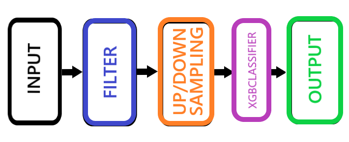
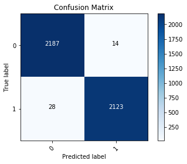
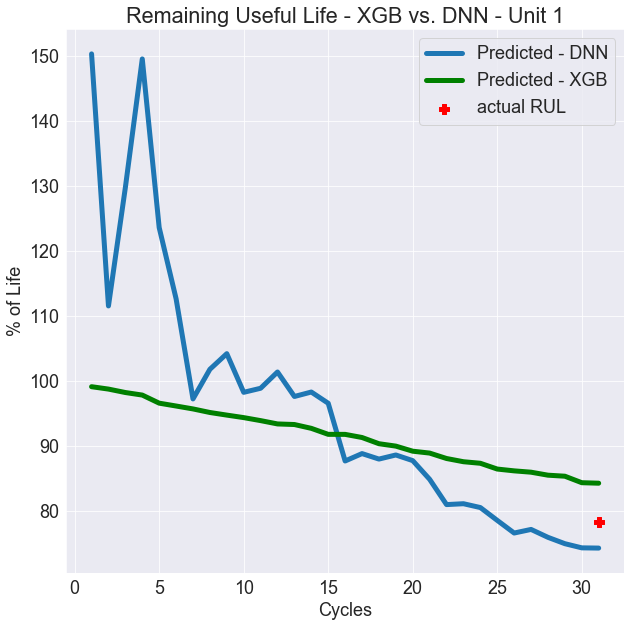

## Fault-Detection-Methodologies

“Prognostics Health Management (PHM) is the interrogation of system state and the assessment of product life in deployed systems using non-destructive assessment of underlying damage. System health is generally assessed in the actual operating environment.”
\
( http://cave.auburn.edu/rsrch-thrusts/prognostic-health-management-for-electronics.html).
That is what is considered the definition of PHM, at least according to Google. Some have called it ‘fault detection’, and that is what I did call it for a while, until I learned that it involves more than just being able to detect when a fault occurs. Its also predicting the remaining life of a machine based on the data collected.
\
It is an interesting topic, considering just about every manufactured item or item that it was manufactured by benefits from knowing approximately when something is going to wrong with it. With my interest peaked, I did some research into methods and performed some experiments on a couple of data sets I was able to find (it is hard to find data like this due to proprietary information). With this, I wanted to take a couple of approaches. First, into direct fault classification, then predicting remaining useful life (RUL).
I should also point out that PHM is also time-series analysis at its core.
\
## Fault Classification
In a nutshell, fault classification is basically a binary classification problem. Did it fault or not fault at this observation? For the sake of your time, I will just go over the model, give a brief of the results and post a link to the Github at the end.
The model I chose for this particular model looked like this:

### Fault Classification Model
Just to highlight the items that may not be as obvious:
#### Filter
The filter I used to preprocess the data was the Kalman Filter. There is many papers conducted, but to summarize, it helps remove the ‘noise’ in sensor data. It is used quite a bit in information received in self-driving car sensors and some other applications. Here is a Medium article on the Kalman Filter https://medium.com/@jaems33/understanding-kalman-filters-with-python-2310e87b8f48 and the Github repo has it coded in python.
#### Up/Down Sampling
In this particular case, less than 1% of the data had an actual ‘yes’ for fault. For problems like this, SMOTE from the imblearn library https://imbalanced-learn.readthedocs.io/en/stable/generated/imblearn.over_sampling.SMOTE.html will randomly generate new samples from the minority label.
Here are the results:

#### Precision: .99 , Recall: .99, F1: .99, CV: 95.4

## Remaining Useful Life
This segment provided a much greater challenge. RUL is predicting the life of a machine based on the data from previous cycles. The data collected for this was from an actual competition from 2008 from the PHM Society. Again, check out the Github to see the data and the full notebook.
I took a much more complex route for this model:

img[rul](rul.png)

### Remaining Useful Life Model
Here are the not so obvious steps:

#### Target Engineering
This particular data set did not have a training target readily available. So I made one by:
1. Taking the cycles that were made available
2. Sorting them in reverse per unit
3. Converting to a percentage of remaining life (an important step)

#### XGBRegressor/Feature Engineering
Why are these two together? Basically this is an example of model stacking. For regression problems such as this, categorical data can be a small annoyance. It made sense to run the categorical data through a trained regression network and use those outputs as another feature. In the end, it did make quite a difference in loss improvement. I tested both a tuned XGBRegressor and a Deep Neural Network. Surprisingly, both had very close results.

#### Unit 1 results — test set RMSE between 49–55
The results from both varied from unit to unit, some where the NN outperformed XGB and vice-versa.

## Takeaways
**If anything is to be gained from this article, it are these takeaways that were discovered:**
\
**Both data sets did not have specifics on the measures being taken** — in theory different types of measurements (pressure, temperature, vibration) would have different types of methodology that would apply to properly preprocess.
\
**Just from the visual, you can see how Neural Networks learn as they go.** The first few iterations were way off and as it progressed, it honed in on the target.
The opportunity in this field is endless. With the amount of specificity put into these two models with the information given, it is safe to say that any machine and/or material is going to at some point have a model designed for it.
\
**There is a ton of research on this subject and many methodologies approached.** The methods I took may not be the best methods out there and I will continue to research the subject. All comments are welcome. Thanks for your time!
